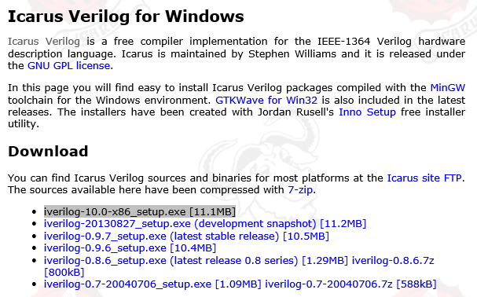
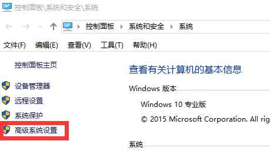
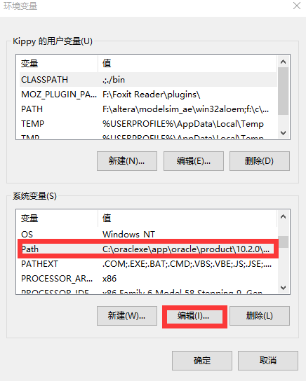
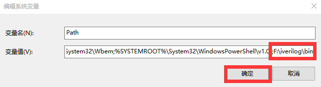

# Verilog HDL 的仿真环境

##Icarus Verilog 下载与安装

可以在 Windows、 Linux 等各种平台运行。

Icarus Verilog 与 GTKWave 官方网站 URL 如下所示：
#####**Icarus Verilog**
http://iverilog.icarus.com/
#####**GTKWave**
http://gtkwave.sourceforge.net/

#####**Icarus Verilog for Windows**
http://bleyer.org/icarus/

从 Download 下方列出的链接下载最新版的安装程序。图 1-1 中 iverilog-10.0-x86_setup.exe [11.1MB] 的链接为最新版。接
着运行下载的安装文件，并根据安装向导安装程序。不需要指定特殊的参数，默认安装
即可。

Icarus Verilog 仿真功能需要从命令行执行。为了确认 Icarus Verilog 已经正确安装，我们打开命令行窗口执行一下。要打开命令行窗口（在搜索栏搜“cmd”）。然后我们在命令行窗口中试着执行一下 iverilog 命令。如果出现“ iverilog: no source files...”信息，则没有问题。如果出现“ 'iverilog' 不是内部或外部命令，也不是可运行的程序或批处理文件。”请按照下面的步骤设定环境变量。
##设定命令查找路径
* 打开“计算机属性”窗口(在开始菜单中右键单击“计算机”， 选择属性)。
* 打开“计算机属性”窗口并单击“高级系统设置”，如图 1-2。
* 点击“高级系统设置”中的“环境变量”。选择“系统变量”中的“Path”，并单击编辑，如图 1-3 和图 1-4。
* 在变量值的末尾追加“;安装路径\bin”，点击“确定”。默认安装的情况下，设定字符串为“;C:\iverilog\bin”，如图 1-5。
* 设定好环境变量之后，再次打开命令行窗口并执行 iverilog 命令。这次应该会出现正确的输出信息 iverilog: no source files... 了。

